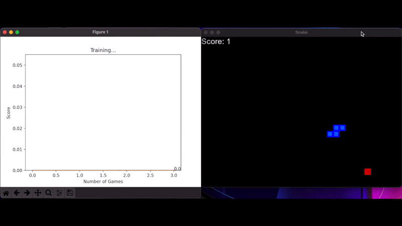

# Reinforcement Learning using PyTorch and Pygame

This is simple demonstration of Reinforcement Learning using the Snake game where the black board and food location are the environment and the snake is the agent. 

The training the takes place follows this structure:

```
Agent():
    init Game()
    init Model() (A simple feed foward Neural Net)

    Agent.train():
        game_state = getGameState
        action = getMoveFrom(game_state) (This is where the model does prediction)
        reward, isGameOver, score = Game.do_action(action)
        new_game_state = getGameState
        Model.train(long_term_memory) 
        remember_some_stuff() (Short term memory)

        if isGameOver:
            Game.reset
            model.train(long_term_memory)
            if score > high_score:
                save(Model.weights)

    
Game():
    do_action(action):
        do stuff
        return reward, isGameOver, score

Model():
    nn = LinearNN()
    train():
        nn.nn_train()
    predict(input):
        return nn.predict(input)
``` 


</img>


